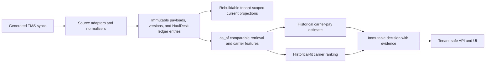
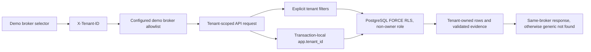

# Carrier Pool

Carrier Pool is a deterministic, multi-tenant decision-support demo for freight
brokers. For each broker-owned `ACTIVE` load, it provides:

1. An expected **carrier payment** with a range of comparable historical payments
   and evidence quality.
2. A **historical-fit call order** for that broker's carriers, with the completed
   work behind each recommendation.

It is not an automated dispatcher. It does not claim a carrier is available,
likely to accept, reliable, or optimal. Historical delivery proximity is evidence
about a past delivery, not live truck location.

## Review this project

### Prerequisites

- Docker Desktop, or Docker Engine with the Compose plugin, running.
- Python 3.13 and [`uv`](https://docs.astral.sh/uv/).
- Node.js 22 and [`pnpm` 11.3.0](https://pnpm.io/installation).

Run all commands from the repository root. No environment file is needed for the
standard local demo. Copy `.env.example` to `.env` only to override its safe local
defaults.

```bash
make setup
make demo
```

`make demo` is the one-command review path. It safely recreates only the dedicated
`carrier_pool_demo` database, generates and validates the deterministic source data,
applies migrations, seeds the demo brokers, ingests every sync chronologically,
persists the Day 11 decisions, builds the containers, and starts the services.

Open:

- UI: <http://localhost:5173>
- API documentation: <http://localhost:8000/docs>

The broker selector contains only these demo brokers:

| Broker | Source system | Day 11 review load |
| --- | --- | --- |
| North Star Freight | FreightFlow | `FF-9001`, Grand Prairie to Katy, dry van |
| Alamo Brokerage | HaulDesk | `HD-9001`, Plano to Baytown, dry van |
| Gulf Bridge Logistics | BrokerOS | `BO-9001`, Katy to San Antonio, reefer |

Start with North Star Freight for rich, near-exact history. Then select Alamo
Brokerage to see deliberately sparse local evidence blended with broader
same-broker history. Gulf Bridge Logistics shows a separate, strong Houston to
San Antonio reefer case. Selecting another broker clears the prior broker's data.

### Verify it

```bash
make check
make backtest
```

`make check` runs formatting, backend and frontend linting, Pyright and TypeScript
checks, unit and contract tests, and production builds. PostgreSQL integration and
browser checks can also be run directly:

```bash
make test-integration
make e2e
```

`make backtest` rebuilds the deterministic demo database, ingests the source files,
persists Day 11 decisions, and writes rolling rate and ranking evaluation artifacts:

- `artifacts/backtest_metrics.json`
- `artifacts/backtest_cases.csv`
- `artifacts/ranking_metrics.json`
- `artifacts/ranking_score_comparison.json`

The artifacts are regression evidence, not a production-accuracy claim. They use
synthetic outcomes and the eventual booked carrier only as a weak ranking proxy.

## What to inspect in the UI

Open any Day 11 load and review:

- Expected carrier rate, a **historical comparison range**, confidence, effective
  evidence count, and the fallback used.
- Comparable completed loads, including route, carrier payment, match tier,
  endpoint distance, and completion date.
- The ordered carrier call list, its evidence-backed component scores, and explicit
  limits for sparse or unsupported history.

Useful demonstration cases are derived from the same catalog that generates the
source files:

| Case | What it demonstrates |
| --- | --- |
| `SC-24` / `FF-9001` | Exact directional DFW to Houston history, rich carrier history, and a narrowest supported rate tier. |
| `SC-25` / `BO-9001` | Nearby Houston to San Antonio reefer history and a high-evidence decision. |
| `SC-26` / `HD-9001` | A small near-exact local group plus regional same-equipment history, yielding an explicitly disclosed blended estimate. |
| `SC-05`, `SC-06`, `SC-07`, `SC-11` | Replacement-snapshot corrections to money, ZIP, equipment, or rate facts. |
| `SC-09`, `SC-10` | HaulDesk append-only financial adjustments, including a negative adjustment. |
| `SC-23` | The same MC/DOT under two brokers remains separate, tenant-owned carrier records. |

The complete scenario list, source files, expected effects, and verification-test
names are in [docs/DATA_SCENARIOS.md](docs/DATA_SCENARIOS.md). The generated,
machine-readable companion is [data/scenarios.json](data/scenarios.json).

## How the system works

The implementation is intentionally small and auditable:



Historical decisions read immutable evidence at their explicit `as_of` cutoff,
never future-aware current projections.



See [the detailed architecture and data-flow diagrams](docs/architecture/data-flow.md)
for the as-of and deterministic scenario-generation flows.

There are three source contracts:

- **FreightFlow** and **BrokerOS** send complete changed-load snapshots. A later
  snapshot can correct a prior total or detail while preserving both versions.
- **HaulDesk** sends append-only rate rows. Its totals are rebuilt from its ledger,
  including negative adjustments.

Each generated historical day has four self-contained syncs per source, at 00:00,
06:00, 12:00, and 18:00. Ingestion accepts only the strict generated filename
pattern and processes one file at a time in chronological order. Reprocessing an
unchanged file is a no-op.

### Lanes and rate evidence

The system uses bundled Texas Triangle ZIP centroids and Haversine endpoint distance,
not runtime geocoding. Direction matters: Dallas to Houston and Houston to Dallas
are different lanes. It begins with near-exact, same-equipment evidence, then widens
through regional, metro-corridor, distance/equipment, and broker-level fallbacks
only when needed. The shown range is a range of historical comparable payments, not
a calibrated prediction interval.

### Sparse carrier history

Carrier ranking combines directional lane similarity, equipment history, recency,
and last recorded delivery proximity. Limited independent history is shrunk toward
a neutral score, and confidence is reported separately. Carriers without enough
relevant evidence are shown as **More history needed**, not as a negative judgment.

### Tenant isolation and time

Every decision, comparable, carrier feature, API query, cache key, and evidence
payload is scoped to one broker. PostgreSQL row-level security and application
queries both enforce that boundary. A cross-broker identifier receives the same
generic not-found response as an unknown identifier. Historical retrieval, pricing,
ranking, stored decisions, and backtests require an explicit `as_of` timestamp and
never use later corrections, assignments, or rates as earlier evidence.

## Data and commands

The data is authored scenario test data, not random or Faker-generated noise. It
covers complete lifecycles, corrections, rich and thin lanes, high- and
low-history carriers, stale and recent delivery evidence, and three fresh Day 11
loads awaiting a carrier.

```bash
make generate             # rewrite only generated plain JSON sync files and data/scenarios.json
make validate             # validate schedule, schemas, identities, timestamps, scenarios, and ZIPs
make correction-demo      # prove correction behavior, immutable decisions, and projection rebuild parity
make ingest               # ingest the generated data into the normal local database
make decisions            # ingest, then persist decisions for active loads
make rebuild TENANT_ID=<uuid>  # rebuild one tenant's projections from immutable facts
make reset                # recreate only carrier_pool_demo, guarded by its fixed name
make down                 # stop Compose services
```

The commented `data/*/example_sync*.jsonc` files are source-contract documentation.
Generation never overwrites them; generated syncs are plain JSON files.

## Main automated evidence

The test suite includes:

- Source parser and serializer contracts for all three TMS formats.
- Deterministic generator, schedule, lifecycle, correction, manifest, and validator
  tests.
- Transactional ingestion, idempotency, current-projection rebuild, and
  source-specific correction tests.
- Direct-SQL RLS, API cross-broker not-found, prediction-invariance, evidence
  isolation, and future-leakage tests.
- Geography, pricing, ranking, sparse-history, and rolling-backtest tests.
- Generated OpenAPI contract, React component, responsive UI, and Playwright review
  tests.

For the detailed engineering tradeoffs, rejected alternatives, model evaluation,
and honest limitations, read [DECISIONS.md](DECISIONS.md).

## Known limitations

- The data and evaluation outcomes are synthetic. They prove deterministic behavior
  and guard against regressions; they do **not** establish production pricing or
  carrier-ranking accuracy.
- No authentication UI, live TMS integration, real-time routing, traffic, truck
  tracking, external geocoding, or shared carrier pool is included.
- The ranking is historical fit only. It cannot measure live availability,
  acceptance probability, service quality, or actual deadhead.
- The pricing range is historical context, not a promise or prediction interval.

See [DECISIONS.md](DECISIONS.md) for the conditions required before tuning weights
or promoting a more complex model.
