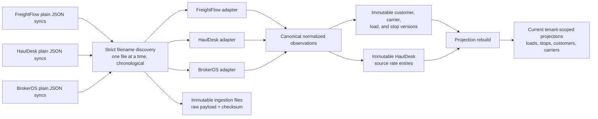
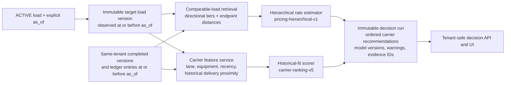
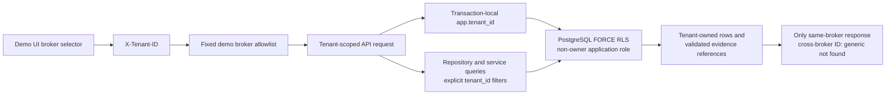
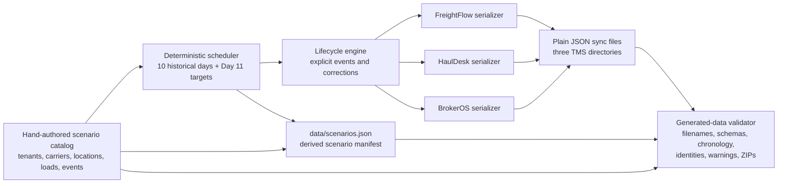

# Carrier Pool data flow

These diagrams describe the implemented deterministic demo. They intentionally omit
external TMS APIs, queues, map providers, shared pools, and other services that the
project does not run.

## Source ingestion and rebuildable projections

FreightFlow and BrokerOS changed-load snapshots create versions. HaulDesk changed
loads create versions and its newly reported financial rows create ledger entries.
Current projections are derived state, not the historical source of truth.

## As-of decision flow

The rate estimator and ranker do not read current projections as historical
shortcuts. A correction observed after `as_of` can affect a later decision, but not
an already stored decision or an earlier backtest input.

## Broker boundary and row-level security

The demo header is accepted only for the configured demo brokers. Application
filters and RLS both enforce tenancy. Embedded JSON evidence is additionally
validated against tenant-local immutable versions before serialization.

## Deterministic scenario generation

The catalog, schedule, serializers, and manifest share canonical definitions.
Generation writes only known plain JSON paths and leaves the JSONC schema examples
untouched.
